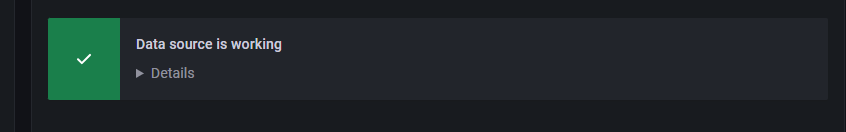

1. **DevOps Phases**:  
   - **Continuous Development**: Involves planning and coding, with tools like Git for maintaining code.
   - **Continuous Integration (CI)**: Developers commit changes frequently, running builds, tests, and reviews to catch issues early.
   - **Continuous Testing**: Automated tools (e.g., Selenium, JUnit) ensure the code is tested for bugs and functionality.
   - **Continuous Deployment**: The code is deployed to production servers, ensuring error-free deployment.
   - **Continuous Monitoring**: Ongoing monitoring of the application’s performance, resolving system errors and maintaining security and availability.

2. **Continuous Monitoring**:  
   Continuous monitoring helps detect and address issues in real time by tracking system metrics, detecting security threats, and improving response time. It also reduces downtime and minimizes negative impacts on business performance.

3. **Grafana’s Role**:  
   Grafana is a popular open-source visualization tool that enables monitoring of real-time data by displaying metrics in customizable dashboards. It integrates with various data sources like Prometheus, Graphite, and InfluxDB.

4. **Tools in the DevOps Monitoring Ecosystem**:  
   - **Monitoring Tools**: Examples include Prometheus, Nagios, and Sensu for tracking infrastructure and application performance.
   - **Configuration Management Tools**: Tools like Ansible, Chef, and Puppet automate system provisioning and ensure configurations remain consistent.
   - **Alerting Tools**: PagerDuty, Slack, and ServiceNow help with incident response by triggering alerts based on system events.
   - **Metric Storage**: InfluxDB, Splunk, and AWS store and analyze large volumes of data collected during monitoring.

5. **Grafana Features**:  
   Grafana allows visualization through various types of charts (heatmaps, histograms, etc.), provides real-time alerts, supports multiple data sources, and is open-source. It also allows collaboration by enabling teams to share dashboards.

6. **Getting Started with Grafana**:  
   The session provides a demo on installing Grafana on a local machine (specifically Ubuntu), accessing the user interface, creating dashboards, and customizing visualizations.

7. **Grafana Overview**:
   - The tutorial begins by introducing the Grafana dashboard interface, explaining how to toggle the "Cycle View Mode" to hide or show panels and settings.
   - The left-hand panel contains icons for searching dashboards, creating new dashboards, adding panels, saving configurations, and accessing settings.
   - **Dashboards and Panels**: You can create, organize, and manipulate dashboards and panels. You can add new panels, configure data sources, and choose visualizations (graphs, gauges, etc.).

8. **Creating Dashboards**:
   - You can create dashboards by adding panels and selecting data visualization types. There are many plugins and options, including time series and SQL databases.
   - A "world map" panel can be used to visualize global data (e.g., COVID-19 cases) by importing data with country names, latitude, longitude, and metrics.

9. **Setting Up InfluxDB**:
   - InfluxDB is used as the time-series database for storing and querying data.
   - The process includes installing InfluxDB, creating a database, and configuring Grafana to use it as a data source by entering the InfluxDB URL and database name.

10. **Plugins in Grafana**:
   - The world map panel plugin is installed from the Grafana Plugin repository. After installation, a Grafana server restart is required for the plugin to function properly.

11. **Creating Panels with Data**:
   - Once Grafana is connected to InfluxDB, data from external sources like `trackcorona.live` API can be imported and used to visualize COVID-19 metrics, such as confirmed cases, deaths, and recoveries.
   - The world map visualization requires specific data formatting (latitude, longitude, country name, and metric values).

12. **Additional Features**:
   - Users can set up alerts, manage folders, and explore the database via Grafana's configuration and alerting features.
   - The configuration also includes adding more plugins, managing users and teams, and adjusting themes and preferences.

13. **Data Preparation**:
   - The tutorial starts by downloading a CSV file containing COVID-19 data using `wget` and storing it locally.
   - The data includes country names, latitude, longitude, confirmed cases, deaths, and recoveries.

14. **Python Script for Data Insertion**:
   - A Python script is used to connect to an InfluxDB instance, create a database (`covid19`), and import the data from the CSV into InfluxDB.
   - The script iterates over each row in the CSV, extracts relevant fields (such as country, latitude, longitude, and metric), and sends them to InfluxDB in JSON format.
   - The tutorial emphasizes creating a structured JSON body with fields such as `measurement` (table name), `tags` (properties that repeat, e.g., country name), and `fields` (other relevant data like confirmed cases).

15. **Grafana Setup**:
   - In Grafana, a new dashboard is created to visualize the COVID-19 data on a world map.
   - The tutorial demonstrates configuring the world map visualization using the data from InfluxDB:
     - Selecting the InfluxDB database and measurement.
     - Mapping data fields like country, latitude, and longitude to the map.
     - Customizing colors and thresholds to represent different levels of COVID-19 cases.

16. **Interactive Elements**:
   - The tutorial shows how to use Grafana variables for dynamic and interactive dashboards. Variables can be used to filter data by country or state, and to display different metrics (confirmed cases, deaths, recoveries) based on user selection.

17. **Advanced Configuration**:
   - The video concludes with configuring additional panels for specific states like Maharashtra, Karnataka, and Delhi, showing metrics like confirmed cases, deaths, and recoveries.
   - The dashboard is named and saved, and the use of Grafana variables is highlighted to enhance interactivity.


# Creating a EC2 instance for Grafana

- Grafana has its OWN database (this can be customized)

1. use the free tier options for creating the grafana instance
2. make sure it has a public IP address
3. log into the grafana instance and `sudo apt-get update` and `sudo DEBIAN_FRONTEND=noninteractive apt-get upgrade -y`.
4. switch to be a root user ```sudo su -```
5. we need a docker container for grafana - install docker
   1.  some prerequisites are required to let spt use packages over HTTPS ```apt install apt-transport-https ca-certificates curl software-properties-common```
   2.  add the GPG key for the official docker repo to the instance ```curl -fsSL https://download.docker.com/linux/ubuntu/gpg | sudo apt-key add -```
   3.  add the docker repo to the APT sources ```add-apt-repository "deb [arch=amd64] https://download.docker.com/linux/ubuntu focal stable"```
   4.  now install docker from the docker repo we just added ```apt install docker-ce```
   5.  check the status ```systemctl status docker```
6. use docker run (in detached mode) to create a container for grafana image version 9.0.5 that runs on port 3000 (where grafana runs- default) ``` docker run -d -p 3000:3000 --name=grafana grafana/grafana:9.0.5```
7. now take the public IP of your instance and search it on your browser to bring up the grafana UI on port 3000

# Creating a EC2 instance for Prometheus

**Prometheus is being used a a backend from which the metrics are being selected from to display using Grafana**

1. Set up an EC2 instance using Ubuntu. Ensure the security group allows `SSH`, `HTTP` and port `9090` (Prometheus uses this port).
2. `sudo apt-get update` and `sudo DEBIAN_FRONTEND=noninteractive apt-get upgrade -y`.
3. Install the prometheus node exporter `sudo apt-get install prometheus prometheus-node-exporter -y`.
4. configure the Prometheus yaml file: `sudo nano /etc/prometheus/prometheus.yml`
5. the yaml file should look like this
 
```yaml
global:
  scrape_interval: 15s

scrape_configs:    # this is telling prometheus where to scrap from
  - job_name: 'prometheus'
    static_configs:
      - targets: ['localhost:9090']
  - job_name: 'node_exporter'
    static_configs:
      - targets: ['localhost:9100']

```
1. Start Prometheus `sudo systemctl start prometheus`
2. Enable it `sudo systemctl enable prometheus`
3. Access it using your EC2's public IP with a port of `9090`


# Connect Granfana to Prometheus 

8. login with default username= admin123, password= admin123
9. you can change your log in and password to whatever
10. when logged in go to config on the left menu - select data source
11. there are many options and metric storage tools (influxdb, splunk or aws) but we are using prometheus
12. name it - 'prometheus test'
13. put the endpoint url of the prometheus instance "EC2 Public IP:9090"
14. can add timeout and authentication- but this is just a test and therefore not required
15. download and configure prometheus first then you can save and test- should be green




# Node Exporters
1. ssh into the prometheus vm
2. install the latest version of the binary ```VERSION="1.8.2"
wget https://github.com/prometheus/node_exporter/releases/download/v${VERSION}/node_exporter-${VERSION}.linux-amd64.tar.gz```
3. extract the files you've just downloaded and cd into the file ```tar -xvf node_exporter-${VERSION}.linux-amd64.tar.gz
cd node_exporter-${VERSION}.linux-amd64```
4. move the node exporter to the bin folder ```sudo mv node_exporter /usr/local/bin/```
5. create service file for the Node Exporter ```sudo nano /etc/systemd/system/node_exporter.service```
6.  add this script 
```systemd
[Unit]
Description=Node Exporter
After=network.target

[Service]
User=node_exporter
Group=node_exporter
Type=simple
ExecStart=/usr/local/bin/node_exporter

[Install]
WantedBy=multi-user.target
```

**Explanation:**
- **[Unit]:** Defines metadata and dependencies for the service.
- **[Service]:** Contains details about how the service is executed (e.g., user, executable, service type).
- **[Install]:** Specifies how the service is installed/enabled (e.g., target configurations for startup). 
7. add a system user ```sudo useradd --no-create-home --shell /bin/false node_exporter```
8. reload systemd ```sudo systemctl daemon-reload```
9. 9. enable the service ```sudo systemctl enable node_exporter```
10. start the service ```sudo systemctl start node_exporter```
11. check if the not exporter service is running ```sudo systemctl status node_exporter```
12. 